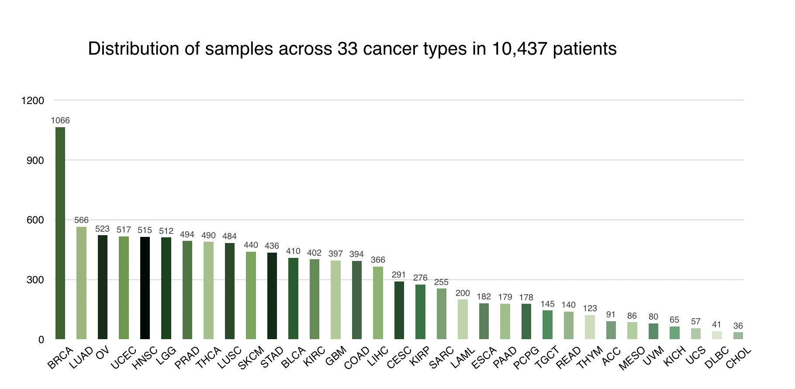

# Hotspot-mutation

## Introduction
Identification of hotspot mutations and corresponding wild type and mutated peptides. Somatic mutation data was downloaded from https://api.gdc.cancer.gov/data/1c8cfe5f-e52d-41ba-94da-f15ea1337efc. It includes 33 cancer types in 10,437 patients. Below is the summary for number of patients in each cancer type. 

## Topmutations

Hugo_Symbol: HUGO symbol for the gene (HUGO symbols are always in all caps).
amino_acid_change: variation affects the protein-coding sequence
Chromosome: The affected chromosome
Start_Position: Lowest numeric position of the reported variant on the genomic reference sequence. Mutation start coordinate
End_Position: Highest numeric genomic position of the reported variant on the genomic reference sequence. Mutation end coordinate
Freq: total number of samples having this missence mutations  
mutRates(number of samples): Freq divided by number of samples

#25mer
Hugo_Symbol: HUGO symbol for the gene (HUGO symbols are always in all caps). 
Chromosome: The affected chromosome
Start_Position: Lowest numeric position of the reported variant on the genomic reference sequence. Mutation start coordinate
End_Position: Highest numeric genomic position of the reported variant on the genomic reference sequence. Mutation end coordinate
Strand: Genomic strand of the reported allele. In Bailey's pan-cancer data, all variants will report the positive strand: '+'
Variant_Classification: Translational effect of variant allele
Variant_Type: Type of mutation
Reference_Allele:The plus strand reference allele at this position. 
ALT: Tumor sequencing (discovery) allele 
wild_25merpeptide: 25-mer wild peptides 
mut_25merpeptide: 25-mer mutated peptides containing the nonsynonymous mutations flanked by on both sides by 12 normal amino acids
Mutation: variation affects the protein-coding sequence
dbSNP_ID: If known identifier of existing variation was seen in dbSNP database, its ID will be listed here; Or this blank was set as "NULL"
COSMIC_ID:If known identifier of existing variation was seen in COSMIC database, its ID will be listed here; Or this blank was set as "NULL"

#tp53_kras_stats.xlsx
Hugo_Symbol: HUGO symbol for the gene (HUGO symbols are always in all caps).
AAchange: variation affects the protein-coding sequence
CHOL(36): total number of samples having this missence mutations /all samples (36 samples all)
COAD(394): total number of samples having this missence mutations /all samples (394 samples all)
LUAD(566): total number of samples having this missence mutations /all samples (566 samples all)
LUSC(484): total number of samples having this missence mutations /all samples (484 samples all)
OV(523): total number of samples having this missence mutations /all samples (523 samples all)
PAAD(179): total number of samples having this missence mutations /all samples (179 samples all)
READ(140): total number of samples having this missence mutations /all samples (140 samples all)
UCEC(517): total number of samples having this missence mutations /all samples (517 samples all)
